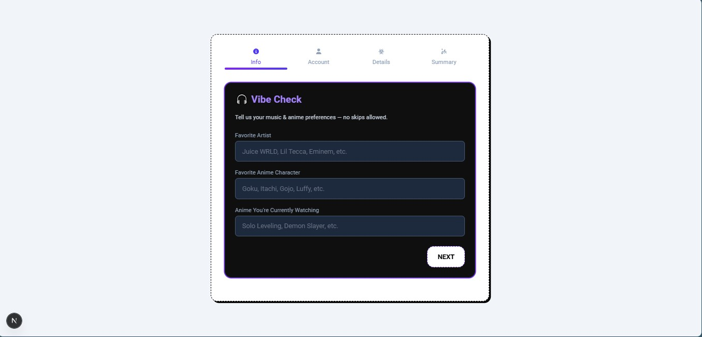

# Multi-Step Vibe Registration Form 🎧🔥

This project is a multi-step registration form built with **Next.js**, **TypeScript**, and **React Hook Form**, enhanced with **Framer Motion animations** and a personal twist — the form includes themed questions around **music** and **anime**, making it fun and expressive for creative users or dev community profiles.

## 🚀 Live Demo
**Vercel Link**: [https://your-vercel-link.vercel.app](https://your-vercel-link.vercel.app)  
**GitHub Repo**: [https://github.com/byteprowler/mentorled-form](https://github.com/byteprowler/mentorled-form)

---

## 📸 Screenshots


---

## ✨ Features

- ✅ 4-Step Animated Form Flow
- 🎯 Smooth form validation with React Hook Form
- 🎨 Custom UI theme (dark mode, glitch-inspired styling)
- 🎧 Anime & music-themed questions for personality
- ⚡ Framer Motion transitions between steps
- 📱 Fully responsive for mobile & desktop
- 🔒 Summary screen to confirm details before submission

---

## 🧩 Tech Stack

- **Next.js** 15
- **TypeScript**
- **TailwindCSS**
- **Framer Motion**
- **React Hook Form**

---

## 🧠 Project Structure

📁 components/
│ ├── StepOne.tsx
| |-- ProgressBar.tsx
│ ├── StepTwo.tsx
│ ├── StepThree.tsx
│ ├── Summary.tsx
│ └── Button.tsx
📁 pages/
│ └── index.tsx


---

## 🛠️ Getting Started

### 1. Clone the repo

```bash
git clone https://github.com/your-username/multistep-form.git
cd multistep-form
npm install
npm run dev